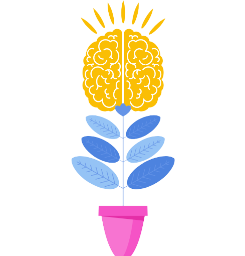
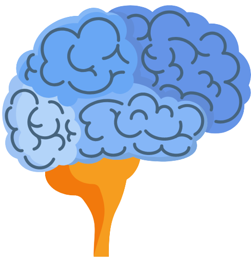
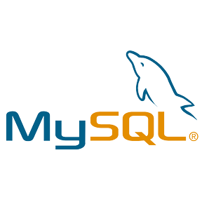
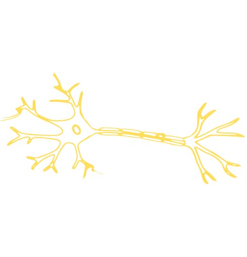
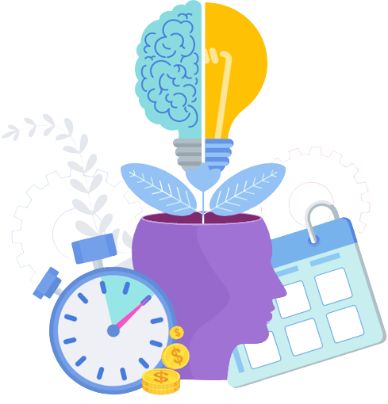

<h2 align="center">
    
    Hi There
    
</h2>
    



```Python
    + Hi guys, I'm Nadim, a third-year undergraduate student 
     
     in Cognitive Science at the IDMC - University of Lorraine.
     
    
    + My passion for both computer science and cognitive science
     
     has led me to explore the fascinating intersection between
     
     these two fields.
```

    
<br>


<div align="center">
    <table align="left">
        <tr>
            <td align="center" width="140" height="112.43">
                
                <br /> Java
            </td>
          <td align="center" width="140" height="112.43">
                
                <br /> Javascript
            </td>
          <td align="center" width="140" height="112.43">
                
                <br /> C
            </td>
        </tr>
        <tr>
            <td align="center" width="140" height="112.43">
                
                <br /> MySQL
            </td>
            <td align="center" width="140" height="112.43">
                
                <br /> Python
            </td>
            <td align="center" width="140" height="112.43">
                
                <br /> R
            </td>
        </tr>
    </table>
    
    
</div>

<br>



```Python
    + Im eager to gain practical experience and contribute to the
    
    development of innovative solutions that can enhance human
    
    cognition and decision-making.
    
    
    + Im particularly interested in topics such as
    
    artificial intelligence, machine learning, and data science.
    
    
    + In my free time, I enjoy tinkering with code, reading about
    
    the latest advancements in cognitive science, and playing music.
```
<h2 align="center">🤝🏻Connect with Me🤝🏻</h2>

<p align="center">
    
</p>
<p align="center">
<a href="https://www.linkedin.com/in/nadim-saleem-726166195"></a>
<a href="mailto:nadeemsalim0@gmail.com"></a>
</p>
    
